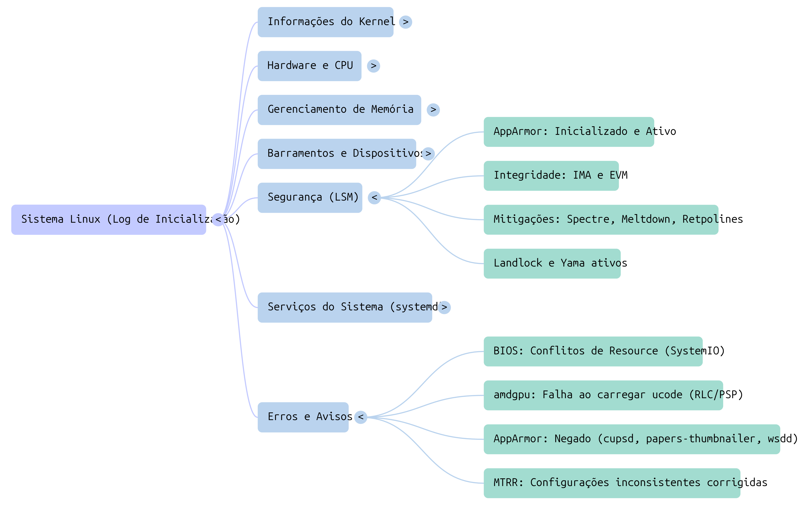

# 🚀 Acelerando Auditoria Pontual de Logs de Sistema com NotebookLM

## 📖 Sobre o Projeto
Este repositório foi desenvolvido como parte do curso da **DIO (Digital Innovation One)**: *"Acelere sua Aprendizagem com IA: Explore o Poder do NotebookLM"*.
O objetivo é demonstrar como utilizar a ferramenta NotebookLM do Google para otimizar pesquisas técnicas,  criar um fluxo de educação acelerada.

## 🧠 Estudo de Caso: Diagnostico Otimizado
Este estudo de caso demonstra como o uso de inteligência artificial generativa, especificamente o NotebookLM, supera métodos tradicionais em auditorias pontuais e investigações de "causa raiz".

### Objetivo
Utilizar o NotebookLM para transformar uma massa de dados brutos (documentações, vídeos e artigos) em um **segundo cérebro** consultável e capaz de gerar insights em minutos.

## 🛠️ Tecnologias Utilizadas
* **NotebookLM (Google):** IA para análise de fontes e síntese de conhecimento.
* **GitHub:** Para versionamento e compartilhamento do estudo de caso.
* **Hardware:** Usei meu desktop pessoal. Criei sistema em pendrive para os testes, e usei adaptadores USB antigos de wifi e Bluetooth.

### **Comparado à Leitura Manual**
*   **Velocidade de Correlação:** Enquanto um humano levaria horas para cruzar informações entre o `dmesg` e o `syslog`, o NotebookLM identifica instantaneamente que a falha de firmware da GPU no boot está correlacionada com a lentidão do sistema registrada posteriormente.
*   **Identificação de Agulhas no Palheiro:** Erros sutis, como o aviso de "bad username" no `/etc/crontab`, que invalidam todo o agendador de tarefas, são facilmente detectados pela IA.
*   **Detecção de Inconsistências:** A IA identificou rapidamente que o sistema se apresenta como **Lubuntu 23.10** no boot, mas o daemon do Snap o reconhece como **Ubuntu 25.10**.

### **Comparado ao Desenvolvimento de um ETL (Extract, Transform, Load)**
*   **Custo e Tempo:** Criar um pipeline de ETL para converter logs brutos em tabelas relacionais exige infraestrutura e tempo. O NotebookLM permite auditorias **ad-hoc** (pontuais) sem necessidade de configuração prévia de bancos de dados como ElasticSearch ou Splunk.
*   **Análise Semântica:** Diferente de filtros SQL rígidos, a IA compreende o contexto. Ela entende que "Host is down" e "Connection refused" em logs de Bluetooth são sintomas de uma falha de hardware ou firmware relatada pelo kernel.

## 📈 Fluxo de Trabalho (Workflow)

### 1. Curadoria de Fontes
Foram selecionadas as seguintes fontes para alimentar a IA:
Logs do sistema ( anonimizados previamente ):
boot.log_final.txt
dmesg_final.txt
kern_final.txt
syslog_final.txt

### 2. Processamento e "Grounding"
Diferente de IAs generativas comuns, o NotebookLM foi configurado para responder **estritamente com base nos documentos fornecidos**, garantindo que as respostas sejam técnicas e sem "alucinações".

### 3. Otimização de Pesquisa
Foram criadas notas automáticas de:
Relatório de Atividades e Diagnóstico do Sistema (USUARIO-a320ms2h)
Relatório de Diagnóstico Técnico: Instabilidades do Serviço Bluetooth e Postura de Segurança AppArmor
Diagnóstico de Conflitos e Falhas de Inicialização do Sistema
Diagnóstico e Resolução de Erros Críticos do Sistema Linux
Plano de Otimização e Estabilidade do Sistema Gigabyte AMD
Diagnosticando crash do Bluetooth no syslog ( AUDIO)

## 3. Passo a Passo para Auditoria

1.  **Coleta de Fontes:** Extraia os logs principais (`dmesg`, `syslog`, `boot.log`, `kern.log`).
2.  **Upload:** Carregue os arquivos brutos como fontes no NotebookLM.
3.  **Investigação Inicial:** Peça um resumo dos erros fatais e avisos críticos.
4.  **Cruzamento de Dados:** Faça perguntas específicas como: *"Existe algum conflito de rede relatado?"*. A IA retornará os IPs e endereços MAC específicos envolvidos em conflitos.
5.  **Verificação de Segurança:** Questione sobre permissões de arquivos. O sistema apontará, por exemplo, que as permissões do Netplan estão "muito abertas".
6.  **Extração de Hardware:** Solicite um inventário de hardware detectado, incluindo números de série de dispositivos USB e partições de disco.

## 4. Brechas de Segurança e Cuidados

Embora poderoso, o uso de IAs em nuvem para logs requer cautela extrema:

*   **Exposição de Dados Sensíveis:** Logs podem conter informações de identificação pessoal (PII).
    *   **Nomes de usuário** e **hostnames**.
    *   **Endereços MAC** e nomes de redes Wi-Fi (SSID).
    *   **Números de série de hardware**
    *   **UUIDs de partições**, que identificam unicamente os discos do usuário.
    *   **Privacidade da Nuvem:** Ao fazer upload para o NotebookLM, os dados saem do ambiente local. **Nunca faça upload de logs de servidores de produção sensíveis** sem anonimizar IPs, nomes de clientes e chaves de criptografia.
*   **Falsos Negativos:** A IA pode omitir erros se a janela de contexto for ultrapassada. Sempre valide os pontos críticos manualmente após a sinalização da IA.

## 🎯 Resultados
* **Redução de Tempo:** Foram reduzidas de horas para consultas de minutos.
* **Retenção de Conhecimento:** A capacidade de perguntar "Liste os erros mais urgentes ou sugira soluções" diretamente para a documentação acelerou o trabalho.
* **Automação de Notas:** Relatórios que levavam horas para serem organizadas foram geradas e estruturadas automaticamente.
* **Atenção para a segurança:**  Logs podem conter dados sensíveis, e devem ser anonimizados previamente ( pode ser feito via script )

## 🎯 Conclusões*
**Ele não substitui um sistema de monitoramento em tempo real**, mas reduz drasticamente o tempo de resposta em investigações complexas de sistemas.

🖋️ **Projeto realizado por:** Luciana Jorge de Faria

🔗**NotebookLM:**
https://notebooklm.google.com/notebook/a8fade5b-5b18-4040-88e7-1badbc762e45?authuser=4

🔗 **LinkedIn:** https://www.linkedin.com/in/luciana-j-1419461b9/

